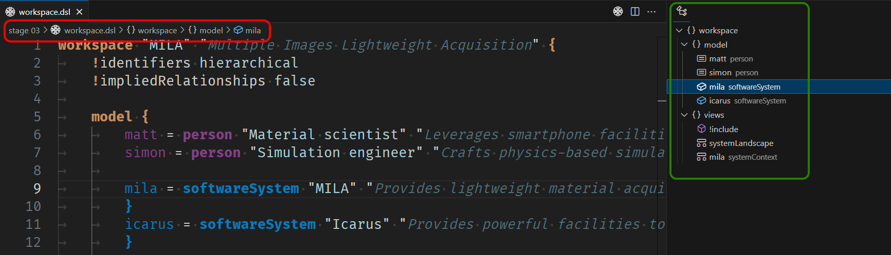

Even if there are some ways to mitigate its expansion, such as leveraging `extends` or `include` facilities, `C4 DSL` workspace is likely to grow over time. To ensure users can efficiently work within sizable workspace, `Cornifer` is able to surface symbols from the `C4 DSL` syntax to support VS Code navigation paradigm through outline and breadcrumb views. Thus, you gain both a schematic overview of the underlying model and a one-click navigation facility. 

