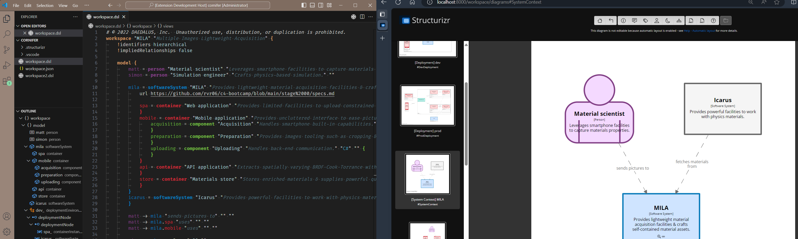

Authoring complex document benefits from live preview facility. You are probably used to use markdown one.

`Cornifer` leverages Structurizr engine to provide views of the model we are currently reading/editing. It mounts the current workspace and instantiates a live session powered by docker engine (prerequisite).
You are now ready to enter the Edit-Save-Refresh cycle to craft your model.

Structurizr session is provisioned when you hit the preview button, and decommissioned when the workspace.dsl is closed.  

