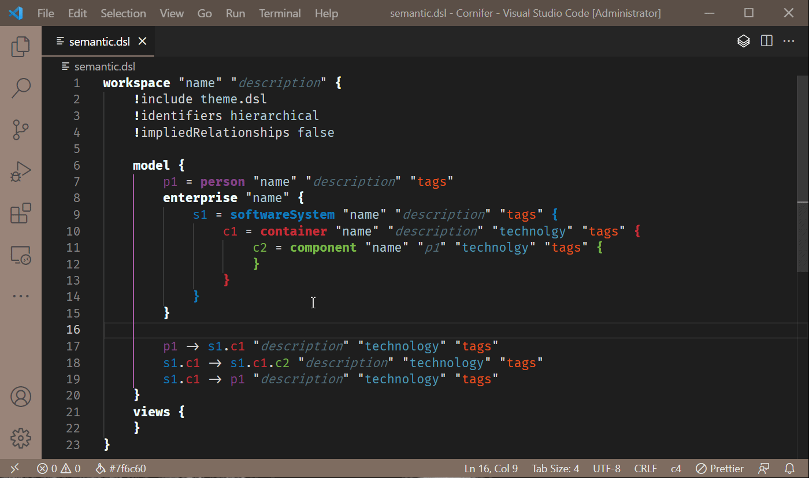

`Cornifer` parses the C4 DSL to gather relevant information such as instance assignment. Once identified and reused, the proper color schema is applied.

Once again, no proper error checks. In the meanwhile, one could easily spot error by monitoring color - or more accurately, lack of. 

