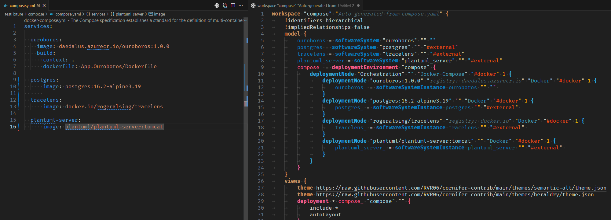
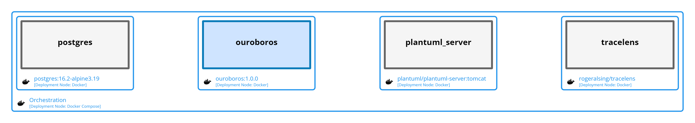

Every sizable paradigm comes with a profession of faith. Container one makes no exception. One of the most appealing promises is about seamless scaling. 

[Docker compose](https://docs.docker.com/compose/) is a broadly used and efficient container orchestrator. It perfectly balances between efficiency & complexity, and it is the de facto way of locally engaging container ecosystem.

Once your application is containerized and locally validated, you can hand over more or less blindly to devops team to cope with the scaling stage. 

Being able to efficiently communicate with devops team is key. To do so, one may want to surface compelling view to support discussion without falling back to plain old `yaml` browsing.

Here comes `Cornifer` and its last `transpiler` feature!



---

## **Given** a valid `compose.yaml` file

```yaml
services:

  ouroboros:
    image: daedalus.azurecr.io/ouroboros:1.0.0
    build:
      context: .
      dockerfile: App.Ouroboros/Dockerfile

  postgres:
      image: postgres:16.2-alpine3.19
      
  tracelens:
      image: docker.io/rogeralsing/tracelens

  plantuml-server:
      image: plantuml/plantuml-server:tomcat
```

## **When** `Cornifer` transpiles matching `workspace.dsl`

```js
workspace "compose" "Auto-generated from compose.yaml" {
	!identifiers hierarchical
	!impliedRelationships false
	model {
		ouroboros = softwareSystem "ouroboros" "" ""
		postgres = softwareSystem "postgres" "" "#external"
		tracelens = softwareSystem "tracelens" "" "#external"
		plantuml_server = softwareSystem "plantuml_server" "" "#external"

		compose_ = deploymentEnvironment "compose" {
			deploymentNode "Orchestration" "" "Docker Compose" "#docker" 1 {
				deploymentNode "ouroboros:1.0.0" "registry: daedalus.azurecr.io" "Docker" "#docker" 1 {
					ouroboros_ = softwareSystemInstance ouroboros "" "" 
				}
				deploymentNode "postgres:16.2-alpine3.19" "" "Docker" "#docker" 1 {
					postgres_ = softwareSystemInstance postgres "" "#external" 
				}
				deploymentNode "rogeralsing/tracelens" "registry: docker.io" "Docker" "#docker" 1 {
					tracelens_ = softwareSystemInstance tracelens "" "#external" 
				}
				deploymentNode "plantuml/plantuml-server:tomcat" "" "Docker" "#docker" 1 {
					plantuml_server_ = softwareSystemInstance plantuml_server "" "#external" 
				}
			}
		}
	}
	views {
		theme https://raw.githubusercontent.com/rvr06/cornifer-contrib/main/themes/semantic-alt/theme.json
		theme https://raw.githubusercontent.com/rvr06/cornifer-contrib/main/themes/heraldry/theme.json

		deployment * compose_ "compose" "" {
			include *
			autoLayout
		}
	}
}
```

## **Then** user is able to visualize diagram through `Structurizr`


